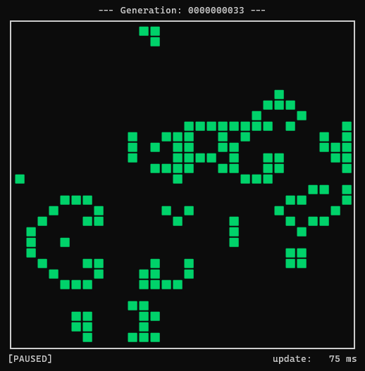

# GameOfLife – High-Performance C++ Simulation Engine

    

A highly optimized, multi-threaded cross-platform (Windows & Linux) implementation of John Conway's *Game of Life* running entirely in the native terminal.

This project was intentionally built as a console application to push code efficiency and hardware-level optimizations to their absolute limits, bypassing heavy graphics frameworks while maintaining ultra-low latency frame times.

<p align="center">
  
  <br>
  <em>Figure 1: Active cellular simulation displaying real-time generation counts, state tracking, and sub-10ms frame dispatching inside a native console window.</em>
</p>

---

## 🚀 Core Features & Technical Highlights

* **Optimized 1D-Array Backend:** Implemented a flattened 1D array topology mapping the 2D grid space. This guarantees maximum CPU **L1/L2 data cache locality** and linear memory access patterns, avoiding pointer-chasing artifacts.
* **True Multi-Threading Architecture:** Strict separation of labor between the **Main (UI) Thread** and a **Persistent Worker Thread** via `std::condition_variable` and `std::mutex`. The main thread handles input and rendering without blocking, while the worker calculates the next generation in the background.
* **Branchless Toroidal Operations:** Complete elimination of division and modulo operations within the critical rendering and calculation paths. Wrapping is achieved using pre-computed hardware-friendly Member Look-Up Tables (`lut_U`, `lut_D`, `lut_L`, `lut_R`), removing pipeline stalls.
* **O(1) Double Buffering:** Board swaps are executed in $O(1)$ time complexity by swapping memory pointers (`std::vector::swap`), entirely avoiding costly deep-copy operations during the game loop.
* **Bypassing the Windows 15.6ms Timer Limitation:** Implemented low-level OS kernel tweaks (`timeBeginPeriod(1)`) to force Windows to scale its scheduler precision down to 1ms, unlocking seamless simulation speeds below the standard 15.6ms OS bottleneck.
* **Zero-Cost-Formatting via `std::format`:** Leverages modern C++20 formatting to significantly reduce stack overhead and compile-time string conversions while completely preventing runtime heap allocations during metadata rendering.
* **Zero-Allocation Terminal Buffering:** High-precision I/O sequencing and stream buffering achieved by flattening the entire frame layout (borders, metadata, and cellular matrix) into a single pre-allocated `std::stringstream`, dropping visual terminal stuttering to 0% at minimal CPU loads.
* **Responsive Fixed Timestep Loop:** Leverages an accumulator-driven clock with a **rallied reset** (`accuTime = 0;`). If terminal rendering or OS context switches stall, the accumulator sheds past latency instantly, ensuring immediate UI responsiveness when changing speeds or pausing.
* **Bespoke Cross-Platform Input Handling:** Custom, non-blocking single-press key detection (`KeyInput.h`) engineered for both Windows and Linux terminal modes without relying on CPU-melting asynchronous polling cascades (no `GetAsyncKeyState` continuous firing).

---

## 📂 Project Structure

```text
GameOfLife/
├── image/
│   └── showcase.png      # High-resolution terminal showcase displaying engine metrics
├── src/
│   ├── KeyInput.h        # Unified cross-platform input system (unified key codes)
│   ├── GameOfLife.h      # Class architecture, compile-time UI constants, and Figure Enum
│   ├── GameOfLife.cpp    # Definitions, core simulation engine, multithreading & memory LUTs
│   └── main.cpp          # Application entry point with flexible instantiation examples
├── .gitignore            # Specifies intentionally untracked files to ignore
├── LICENSE               # MIT License File
└── README.md             # Project documentation and architecture overview
```

### Module Breakdown

* **`KeyInput.h`**: Implements a synchronous, cross-platform terminal interface that translates low-level OS input streams (Windows `conio.h` / Linux `termios.h`) into unified internal key codes. It guarantees a single-press event evaluation per frame, effectively preventing CPU-heavy async polling chains.
* **`GameOfLife.h`**: Defines the blueprint of the simulation engine. It contains type-safe configurations, compile-time constants (`constexpr`) for zero-allocation terminal styling (ANSI escape sequences, cell glyphs), and the declarative layout of the central `Figure` enum.
* **`GameOfLife.cpp`**: Houses the entire concrete implementation. It manages the lifecycle and synchronization boundaries of the persistent worker thread, pre-calculates the spatial 1D look-up tables (LUTs) for branchless wrapping, maps predefined shape coordinate arrays, and executes the core cellular automaton rules.
* **`main.cpp`**: Serves as the clean application entry point. It demonstrates how to instantiate the engine seamlessly, exposing configurations for deploying either targeted structural seeds (e.g., Pulsar, Gosper Glider Gun) or statistically weighted, randomized distribution grids.

---

## 🕹️ Controls

The loop is designed to be highly reactive. Inputs instantly force a state redraw to prevent visual lag:

| Key | Action |
| :--- | :--- |
| `SPACE` | Pause / Resume the simulation |
| `ARROW UP` | Speed up (Reduces update interval) |
| `ARROW DOWN` | Slow down (Increases update interval) |
| `ESC` | Safe exit (Gracefully joins and terminates the background worker) |

*Design Note:* Speed ramping is adaptive. Intervals scale by **5ms steps** below 345ms for granular control, and dynamically switch to **10ms steps** above it to eliminate tedious key-spamming when adjusting up to 1000ms.

---

## 🧠 The Loop Design & Thread Synchronization

The main simulation loop balances extreme responsiveness with eco-friendly CPU utilization by embedding a baseline 4ms sleep interval to prevent context-switch thrashing.

```cpp
while (isRunning)
{
    auto now = std::chrono::steady_clock::now();
    auto elapsedTime = std::chrono::duration_cast<std::chrono::milliseconds>(now - lastTime).count();
    lastTime = now;

    accuTime += elapsedTime;

    // Instantly catch user interactions without waiting for the next physics tick
    if (processInput())
        drawBoard();

    if (accuTime >= updateTime)
    {
        if (!isPaused && isRunning)
        {
            ++currGen;

            swapBoards();      // Pointer exchange O(1)
            drawBoard();       // Flush pre-buffered stringstream to console
            calcNextBoard();   // Notify the sleeping worker to calculate Gen+1 immediately!

            accuTime = 0;      // Hard reset to wipe latency queues and stabilize framerates
        }
    }

    std::this_thread::sleep_for(std::chrono::milliseconds(4)); // CPU conserving base sleep
}
```

### Worker Lifecycle Spot
The persistent worker thread bypasses initialization overhead after application startup. It rests in a low-power kernel wait state at `cvStart.wait()` and wakes up instantly when flagged, executing pure 16-bit space additions across the look-up boundaries before releasing its lock explicitly to maximize main thread wakeup times.

---

## 🔨 Compilation & Build

The engine is engineered using standard ISO C++20 without any external dependencies. Since the heavy simulation logic and thread environments are strictly separated into implementation files, compiling the project requires a standard multi-source build invocation.

### Prerequisites
* A modern C++ compiler supporting **C++20** (e.g., `g++` 11+, `clang` 13+, or MSVC latest).

### Build Command
To compile and run the high-performance simulation on Linux or Windows (via MinGW/GCC/WSL), execute the following commands in your terminal:

```bash
# Clone the repository
git clone https://github.com/iibram/GameOfLife.git

# Change directory
cd GameOfLife

# Compile all source files with high-level performance optimization
g++ -std=c++20 -O2 src/*.cpp -o game

# Run the engine
./game
```
---

## 🗺️ Future Roadmap

* [ ] **Toroidal Toggle Switch (`isTorusEnabled`):** Implement a runtime flag to switch boundaries between a closed loop donut system and hard termination walls. This will prevent magnificent complex structures like the `GOSPER_GLIDER_GUN` from firing projectiles into their own backs due to torus space wrapping.
* [ ] **Multi-Shape Seeding:** Add functionality to inject multiple predefined cellular patterns into designated coordinate offsets on a single active board.

---

## 📄 License
This project is licensed under the MIT License - see the [LICENSE](LICENSE) file for details.
